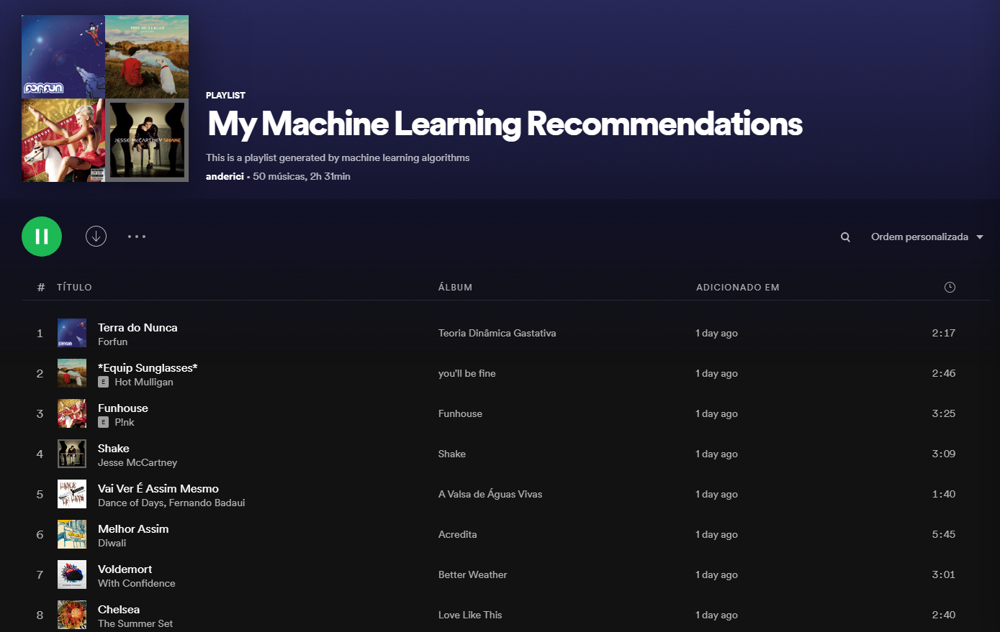

# Improving Spotify recommendations with Python and Machine Learning
> Applying machine learning techniques to predict Spotify's recommendation affinity to the user

This project uses machine learning algorithms to create a playlist with brand new recommendations which I'm more likely to like.

Basically, the idea is to retrieve the user's current top tracks, besides the saved ones (considered the songs I like). From these tracks, get new recommendations with Spotify engine (considered the songs that aren't part of the songs I like). A **Random Forest** model was trained to classify these data.

Finally, we get a bunch of brand new songs recommendations from Spotify and use the model to predict the probability of these songs being part of my favorite ones. This information is used to filter the tracks and add the tracks with greater probability to a new playlist.

## Dependencies

```
pip install sklearn
pip install spotipy
pip install pandas
```



- [Link to my generated playlist](https://open.spotify.com/playlist/0YItHce8pM4GnDJgftYspI?si=8e25bf9fa9c4422d)